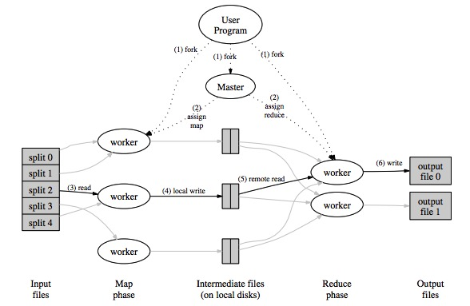

## MIT 6.824

课程地址: [6.824 Schedule: Spring 2017](https://pdos.csail.mit.edu/6.824/schedule.html)

当前目录下:

- src: 源码
- picture: 截图
- paper: 论文

## LEC 1: MapReduce

架构图如下：



**Part I: Map/Reduce input and output**

```
▶ go test -run Sequential
master: Starting Map/Reduce task test
Merge: read mrtmp.test-res-0
master: Map/Reduce task completed
master: Starting Map/Reduce task test
Merge: read mrtmp.test-res-0
Merge: read mrtmp.test-res-1
Merge: read mrtmp.test-res-2
master: Map/Reduce task completed
PASS
ok      _/Users/xiaqunfeng/distributed-study/6.824/src/mapreduce    2.447s
```
